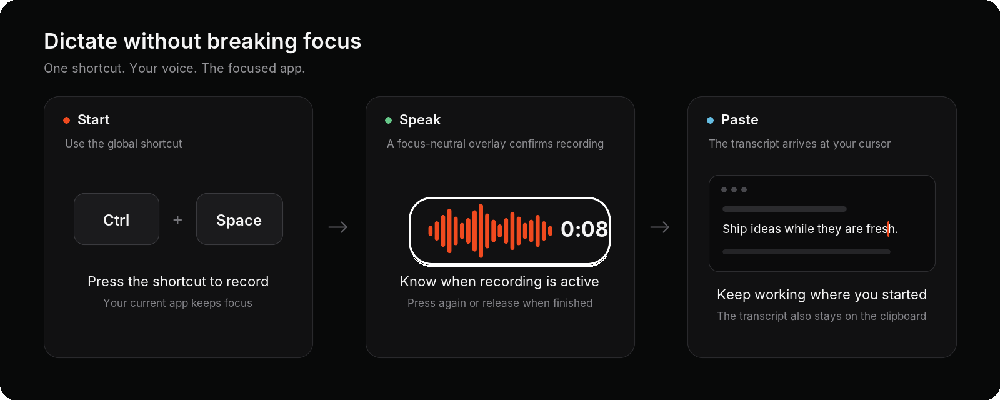

<p align="center">
  
</p>

<h1 align="center">AgentDictate</h1>

<p align="center"><strong>Native push-to-talk voice dictation for Linux.</strong></p>
<p align="center">Press <kbd>Ctrl</kbd> + <kbd>Space</kbd>, speak, and paste an OpenAI transcript into the focused app on Wayland or X11.</p>
<p align="center"><code>Ctrl+Space → Speak → Transcribe → Paste</code></p>
<p align="center"><sub>OpenAI speech-to-text · Rust + GPUI · Local history and recovery</sub></p>

<p align="center">
  <picture>
    <source media="(max-width: 640px)" srcset="docs/images/agentdictate-hero-mobile.png">
    
  </picture>
</p>

<p align="center"><a href="#install"><strong>Install AgentDictate →</strong></a></p>

- **Reliable** — checkpointed recovery protects interrupted recordings.
- **Custom** — optional prompt cleanup and spoken replacements.
- **Searchable** — local, typo-tolerant transcript history.

## Install

The source installer currently targets Ubuntu/Debian. Install the [system prerequisites](docs/INSTALL.md#requirements), then:

```bash
git clone https://github.com/Luzivog/agentdictate.git
cd agentdictate
./install.sh
agentdictate
```

Add your OpenAI API key in **Settings**, then press `Ctrl+Space` to start or stop dictation. If native input needs attention, follow the installer’s guide or [configure it manually](packaging/NATIVE_ACCESS.md).

AgentDictate requires your own OpenAI API key; API charges apply. Audio is sent to OpenAI for transcription, and optional cleanup sends transcript text. Saved history, recovery data, and settings remain on your machine.

<details>
<summary>Build, test, and package from source</summary>

See the complete [installation and development guide](docs/INSTALL.md).

</details>

[MIT](LICENSE)
