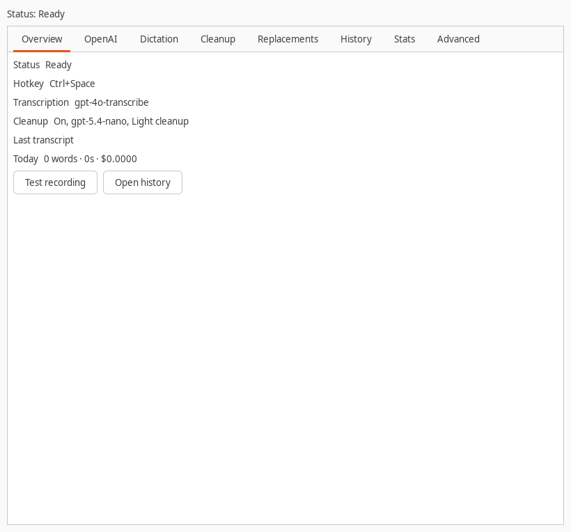
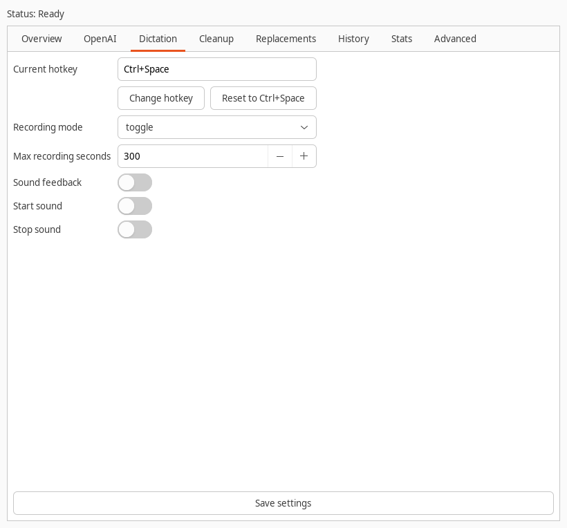
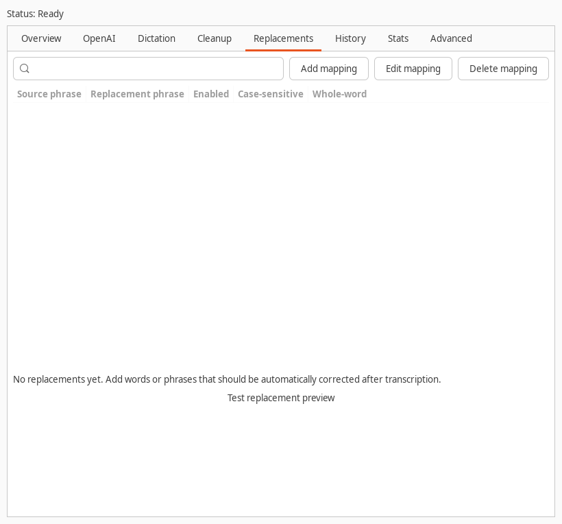

# AgentDictate

Personal Linux push-to-talk dictation for AI coding prompts. Press
`Ctrl+Space`, speak, and AgentDictate transcribes with OpenAI, optionally cleans
the text, applies replacements, copies it to the clipboard, and pastes it.

<p>
  
  
  
</p>

## Install

Install system dependencies first:

```bash
sudo apt install python3 python3-gi gir1.2-gtk-3.0 python3-cairo python3-requests \
  pipewire-bin wl-clipboard ydotool xdotool
```

Then install AgentDictate into your user profile:

```bash
git clone https://github.com/Luzivog/agentdictate.git
cd agentdictate
./install.sh
agentdictate
```

Paste your OpenAI API key in the OpenAI tab, save, then use `Ctrl+Space` to
start and stop dictation.

## Run From Source

```bash
./run.sh
./run.sh --background
```

## Test

```bash
./run-tests.sh
```
